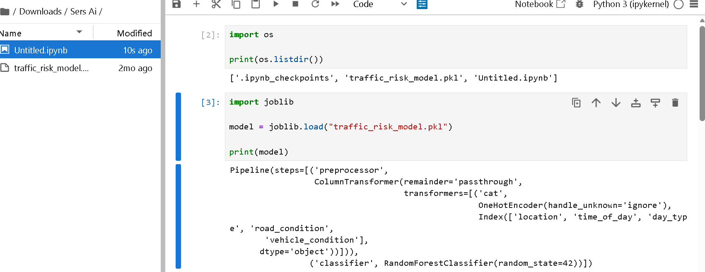
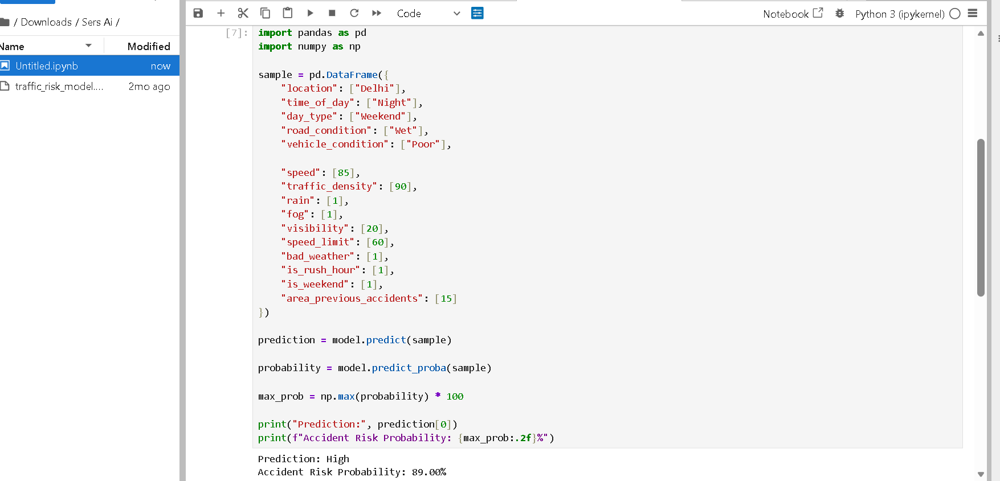
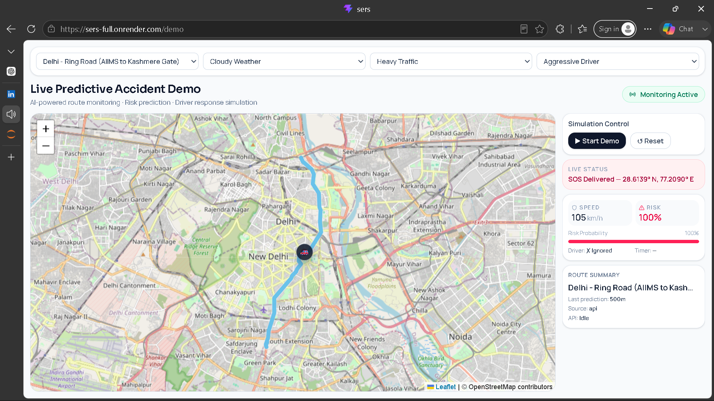

# 🚨 SERS AI+ — Accident Risk Prediction & Emergency Response System

An AI-powered accident prediction and emergency response platform designed to identify high-risk driving situations before accidents happen.

This project combines Machine Learning, real-time monitoring, route visualization, and emergency alert systems to improve road safety and support faster emergency response during critical golden hours.

---

# 📌 Key Features

* 🚗 Real-Time Accident Risk Prediction
* 📍 Live Route Monitoring & Map Visualization
* ⚠️ Risk Classification (Low / Medium / High)
* 📊 Probability-Based Prediction System
* 🚨 SOS Emergency Alert System
* 🏥 Hospital & 🚓 Police Notification Support
* 🔔 Warning Alerts for High-Risk Situations
* 🌧️ Multi-Factor Risk Analysis using:

  * Weather Conditions
  * Traffic Density
  * Driver Behaviour
  * Speed & Visibility Factors

---
# 🚀 Future Improvements

- Real-time GPS integration
- AI voice emergency assistant
- Mobile application support
- Live weather API integration
- Advanced deep learning models

# ⚒️ Tech Stack

## 🤖 Machine Learning

* Python
* Scikit-Learn
* Pandas
* NumPy
* RandomForestClassifier

## 💻 Frontend & Backend

* React
* Tailwind CSS
* Flask

## 📊 Visualization & Monitoring

* Interactive Maps
* Real-Time Route Monitoring
* Risk Visualization System

---

# 🧠 My Contribution

### 👨‍💻 Ajay Singh — Machine Learning & Prediction System

* Built the Machine Learning prediction model
* Performed preprocessing & feature engineering
* Trained and optimized Random Forest classifier
* Generated probability-based accident predictions
* Designed risk classification logic
* Worked on Flask-based ML integration

---

# 🤝 Team Collaboration

### 💻 Keshav Kashyap — Frontend, Maps & Deployment

* Developed frontend using React + Tailwind CSS
* Built interactive map visualization system
* Integrated backend APIs
* Managed deployment and hosting
* Connected predictions with the user interface

---

# 🧠 Machine Learning Workflow

1. Data Collection & Cleaning
2. Feature Engineering & Preprocessing
3. Risk Pattern Analysis
4. Random Forest Model Training
5. Probability-Based Prediction
6. Risk Classification Logic
7. Frontend Integration & Live Monitoring

---

# 📸 Project Screenshots

## 📌 ML Model Pipeline

---

## 📌 Prediction Output

---

## 📌 Live Monitoring & SOS Alert System

---

# 🎯 Project Goal

The goal of SERS AI+ is to reduce accident risk by predicting dangerous driving conditions before accidents occur and improve emergency response support during the golden hour.

Even if this system helps save a single life, the project achieves its purpose.

---

# 🌐 Live Demo

[🚀 Live Demo](https://sers-full.onrender.com/demo)
